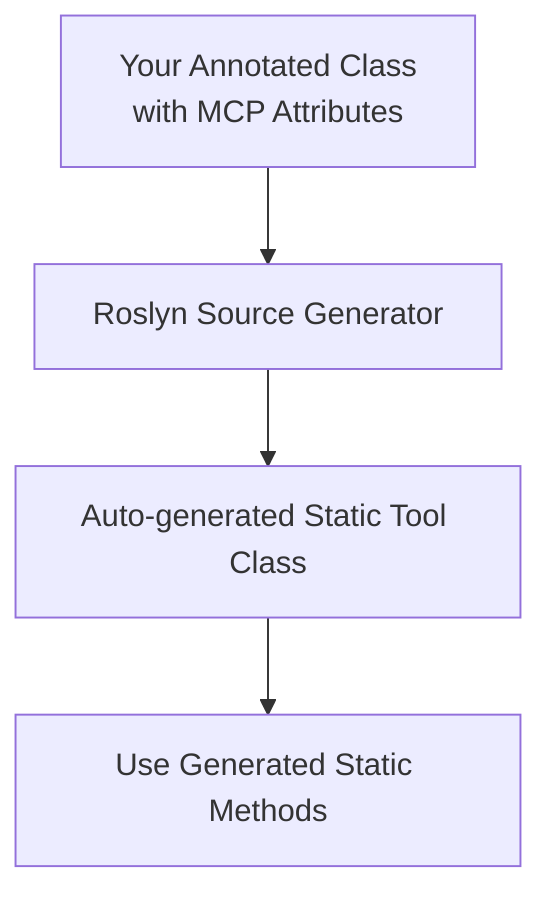

# McpServerToolsGenerator

## Overview

**McpServerToolsGenerator** is a Roslyn incremental source generator for C# that automatically generates static tool classes for server-side tools in the ModelContextProtocol (MCP) ecosystem.

It scans your code for classes and methods annotated with specific attributes and generates static wrapper classes and methods, making it easier to expose server-side functionality in a consistent and discoverable way.

## How It Works

> **Note:** If the Mermaid diagram below does not render, view this README on [GitHub web](https://github.com/) with [Mermaid enabled](https://github.blog/2022-02-14-include-diagrams-markdown-files-mermaid/) or use a Markdown viewer/editor that supports Mermaid.



## Features

- Generates static tool classes for each class annotated with `[McpServerToolNameAttribute]`.
- Wraps methods annotated with `[McpServerToolTypeDescriptionAttribute]` into static methods, including descriptions.
- Uses Roslyn symbol comparison for attribute detection (no hardcoded attribute names).
- Supports multi-targeting (`net9.0` and `netstandard2.0`) for broad compatibility.
- Ensures generated code is consistent and reduces boilerplate.

## Usage

1. **Annotate your server tool classes:**

   ```csharp
   using Common;

   [McpServerToolName("MyClass")]
   public class MyClass
   {
       [McpServerToolTypeDescription("Does something")]
       public int DoWork(int x) => x + 1;
   }
   ```

2. **Build your project.**  
   The generator will produce a static class (e.g., `MyClassTools`) with static methods wrapping your annotated methods:

   ```csharp
   public static class MyClassTools
   {
       [McpServerTool, Description("Does something")]
       public static int DoWork(MyClass myClass, int x) => myClass.DoWork(x);
   }
   ```

3. **Use the generated static methods** in your codebase as needed.

## Requirements

- .NET 9.0 or .NET Standard 2.0 (both supported via multitargeting)
- Microsoft.CodeAnalysis.CSharp (Roslyn) package
- Reference to the `Common` project for attribute definitions

## Project Structure

- `FastTrackGenerator.cs` — The main source generator implementation.
- `Common` project — Contains attributes such as `McpServerToolNameAttribute` and `McpServerToolTypeDescriptionAttribute`.
- Multi-targeted project files for compatibility.

## Contributing

Contributions and issues are welcome! Please open a pull request or issue on GitHub.

## License

MIT License
