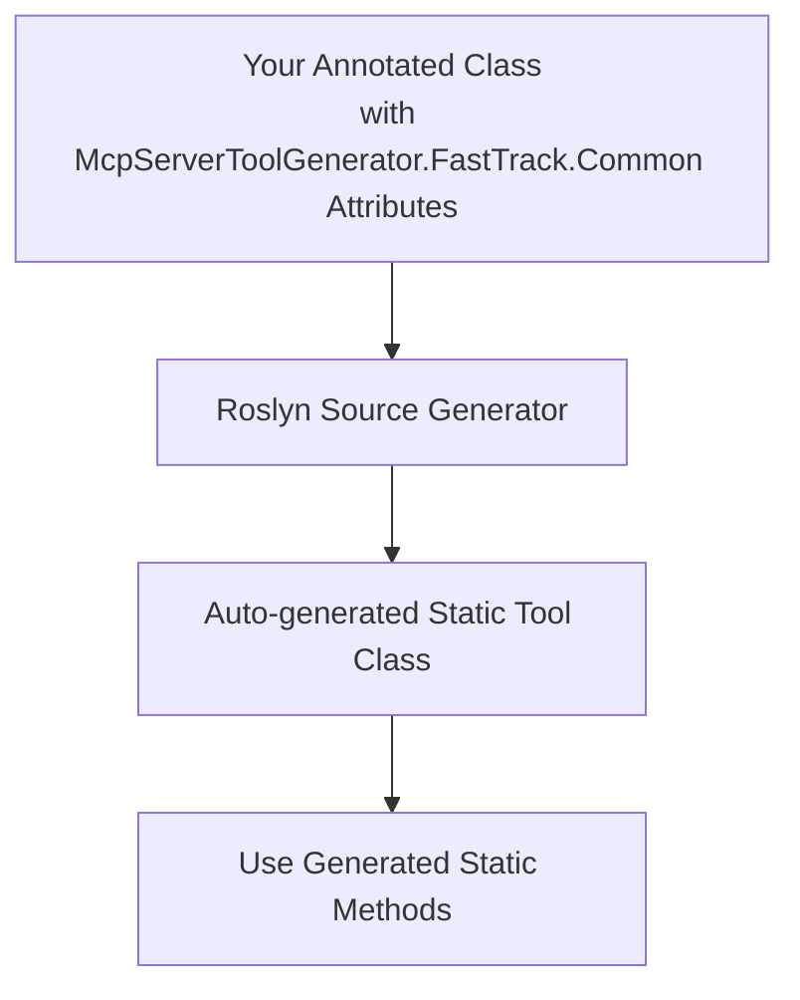

# McpServerToolsGenerator

## Overview

**McpServerToolsGenerator** is a Roslyn incremental source generator for C# that automatically generates static tool classes for server-side tools in the ModelContextProtocol (MCP) ecosystem.

It scans your code for classes and methods annotated with specific attributes and generates static wrapper classes and methods, making it easier to expose server-side functionality in a consistent and discoverable way.

## Core Libraries

| NuGet Package | Version | Description |
|--------------|---------|-------------|
| [McpServerToolGenerator.FastTrack.Common](https://www.nuget.org/packages/McpServerToolGenerator.FastTrack.Common) |  | Shared attributes for MCP server tool generators |
| [McpServerToolGenerator.FastTrack](https://www.nuget.org/packages/McpServerToolGenerator.FastTrack) |  | Roslyn source generator for MCP server tool wrappers |

## How It Works

> **Note:** If the Mermaid diagram below does not render, view this README on [GitHub web](https://github.com/) with [Mermaid enabled](https://github.blog/2022-02-14-include-diagrams-markdown-files-mermaid/) or use a Markdown viewer/editor that supports Mermaid.



## Features

- Generates static tool classes for each class annotated with `[McpServerToolNameAttribute]`.
- Wraps methods annotated with `[McpServerToolTypeDescriptionAttribute]` into static methods, including descriptions.
- Uses Roslyn symbol comparison for attribute detection (no hardcoded attribute names).
- Supports `netstandard2.0` for broad compatibility.
- Ensures generated code is consistent and reduces boilerplate.

## Usage


### Using McpServerToolGenerator.FastTrack and FastTrack.Common NuGet packages

1. **Install the NuGet packages:**

   Add both the FastTrack source generator and the FastTrack.Common attribute library to your project using the .NET CLI:

   ```sh
   dotnet add package McpServerToolGenerator.FastTrack.Common
   dotnet add package McpServerToolGenerator.FastTrack
   ```

   Or via the NuGet Package Manager in Visual Studio, VS Code (with the C# Dev Kit or NuGet Package Manager extension), or JetBrains Rider (right-click the project, choose "Add" → "Add NuGet Packages...").

2. **Annotate your MCP server tool classes:**

   ```csharp
   using McpServerToolGenerator.FastTrack.Common;

   [McpServerToolName("MyClass")]
   public class MyClass
   {
       [McpServerToolTypeDescription("Does something")]
       public int DoWork(int x) => x + 1;
   }
   ```

3. **Build your project.**  
   The generator will automatically produce McpServerTool classes (e.g., `MyClassTools`) with static methods wrapping your annotated methods.

4. **Use the generated McpServerTool generated** in your codebase as needed.
   ```

## Requirements

- .NET Standard 2.0
- Microsoft.CodeAnalysis.CSharp (Roslyn) package
- McpServerToolGenerator.FastTrack.Common for attribute definitions
- McpServerToolGenerator.FastTrack for McpServerTool source generation

## Project Structure

- `FastTrackGenerator.cs` — The main source generator implementation.
- `FastTrack.Common` project — Contains attributes such as `McpServerToolNameAttribute` and `McpServerToolTypeDescriptionAttribute`.

## Contributing

Contributions and issues are welcome! Please open a pull request or issue on GitHub.

## License

MIT License